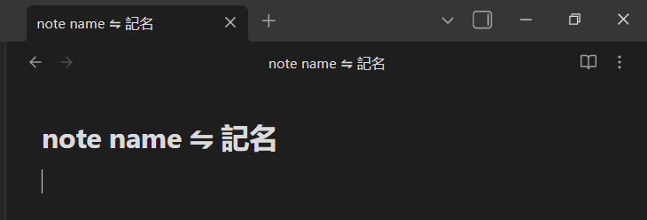

# Dual Title Translator

Automatically add a translated version of your note title while keeping the original — all in a single filename.

Perfect for:
- bilingual or multilingual vaults
- learning languages
- keeping notes searchable in multiple languages

Powered by **DeepL**.

---

## ✨ What it does

When you rename a note, the plugin detects the language of the title and adds a translated version using a configurable separator.

**Example:**

- Нотатки ⇋ Notes
- Проєкт ⇋ Project

The original title is preserved — the translation is added next to it.

---

### 🔑 DeepL API Key

To use the plugin, you need a **DeepL API key**.

1. Go to the official DeepL developer website:  
   👉 https://www.deepl.com/pro-api

2. Create a free DeepL API account
	- The **Free plan** allows up to **500,000 characters per month**
	- A payment card is required during registration (DeepL requirement)
	- You will **not be charged** unless you upgrade the plan

3. Copy your API key

4. Paste the key into the **DeepL API Key** field in plugin settings  
   ⚠️ Make sure there are **no spaces** before or after the key

---

### 🌐 Languages

Select two languages:
- **First language**
	- Can be set manually
	- Or use **AUTO** (DeepL auto-detect)
- **Second language**
	- defaults to English

These languages work **bidirectionally**.

This means:
- If the note title is written in the first language, it will be translated into the second
- If the note title is written in the second language, it will be translated into the first

⚠️ This feature relies on language detection and may not always be perfectly accurate.

---

## 🚀 Installation

### From Obsidian (recommended)
1. Open **Settings → Community Plugins**
2. Disable Safe Mode
3. Click **Browse** and search for **Dual Title Translator**
4. Install and enable the plugin

### Manual
1. Download the latest release
2. Copy it into `.obsidian/plugins/dual-title-translator`
3. Reload Obsidian

---
## 🔒 Privacy & API usage

- Translations are performed via **DeepL API**
- Only the note title is sent for translation
- No data is stored or tracked by the plugin

---

## ❤️ Contributing

Ideas are welcome!

If you find a bug or want a feature, feel free to open an issue.

---

## ⭐ Support

If you like the plugin, consider starring the repository 💙  
It really helps visibility in the Obsidian ecosystem.
